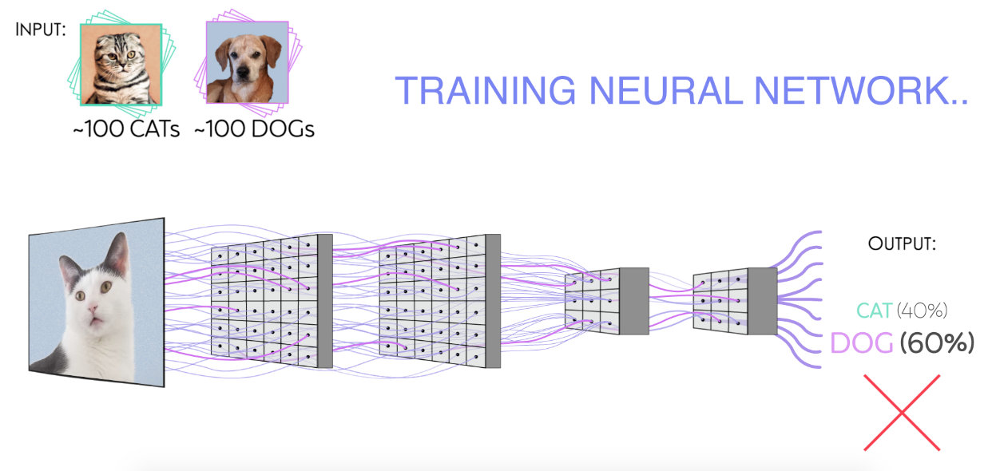
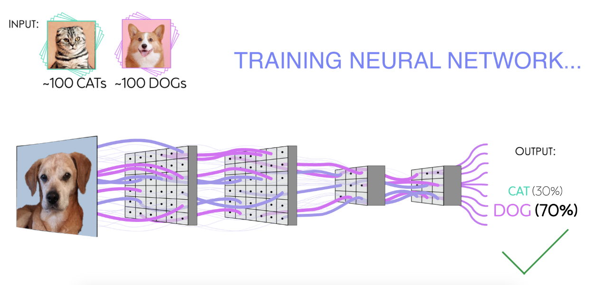

# 2019_carpenter_eliceiri_ibiology

Many thanks to the iBiology team for creating an animation of a deep convolution neural network (CNN) being applied to images!

The animation is included in the Segmentation video, taught by Anne Carpenter & Kevin Eliceiri as part of the iBiology [Bioimage Analysis course](https://www.ibiology.org/online-biology-courses/bioimage-analysis-course/).
The animation was created by [Diana Summers](https://linkedin.com/in/diana-summers) with input from [Juan Caicedo](https://www.broadinstitute.org/bios/juan-c-caicedo), [Anne Carpenter](https://broadinstitute.org/~anne) and others in the Carpenter lab.

The animation can be viewed as embedded within the iBiology tutorial here: http://www.youtube.com/watch?v=jLd2I2adQtw&t=6m54s.

Raw animation files and a final movie are freely available to the community for editing and use. For access to editable source project files or a version of the movie with just the animation, please contact info@iBiology.org.

Example screenshots:

